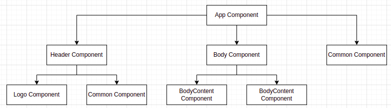
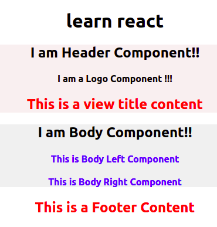

## Objective
This exercise is created to get hands on with using react props to share data between components

## To Do
- Fork the boilerplate
- Clone the forked repository to local system
- Open terminal in forked project location and run `npm i` command to install dependency
- There will be 2 common components named `CommonComponent` and `BodyContentComponent`
- Follow the instruction in each `.js` file in components folder to complete the assignment
- Component tree will be in below format:

- Final Output of App:

# Submitting your solution for preliminary automated review
- Open Hobbes and login into the platform
- Under Assignment repository select react-props, and branch master
- Under Your solution repository select your own repository and branch
- Press Submit
- Press click here for the feedback
- Evaluation will take around 5 mins to complete after which you need to refresh your browser and get the updated status
- Watch out for your total score and detailed status on each test and eslint errors in the coloured blocks on the screen
